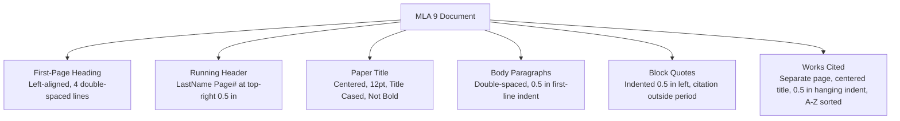

<div align="center">

# 📜 TheBestMLAWriter

### *The distraction-free, strictly formatted MLA document editor with frosted glass transparency.*

[](https://opensource.org/licenses/MIT)
[](https://www.rust-lang.org/)
[](#-mla-9th-edition-rules-enforced)
[](#-cross-platform-support)
[](#-building-from-source)
[](CONTRIBUTING.md)

<p align="center">
  <b>Built from scratch in 100% pure Rust using <code>egui</code> and native OS window vibrancy.</b><br>
  Engineered so that students and academics can focus entirely on writing without fear of formatting penalties.
</p>

</div>

---

## 📑 Table of Contents
- [Why TheBestMLAWriter?](#-why-thebestmlawriter)
- [Key Features](#-key-features)
- [MLA 9th Edition Rules Enforced](#-mla-9th-edition-rules-enforced)
- [Architecture & Design](#-architecture--design)
- [Custom Keybindings](#-custom-keybindings)
- [Frosted Glass & Transparency Engine](#-frosted-glass--transparency-engine)
- [Exporters & File Formats](#-exporters--file-formats)
- [Quick Start & Portable Build](#-quick-start--portable-build)
- [Production Release & Installers](#-production-release--installers)
- [Contributing](#-contributing)
- [License](#-license)

---

## 💡 Why TheBestMLAWriter?

Traditional word processors like Microsoft Word, Google Docs, and LibreOffice are *unconstrained general-purpose editors*. In those apps, small accidental clicks lead to severe academic formatting penalties:
- Accidentally using 1.15 line spacing or adding hidden 8pt margins between paragraphs.
- Using 14pt or 16pt font for headings (prohibited in MLA 9).
- Forgetting to indent body paragraphs by exactly 0.5 inches.
- Typing `"Page 1"` manually instead of a true running header `[LastName] 1`.
- Forgetting to alphabetize Works Cited entries or formatting hanging indents incorrectly.
- Putting citation punctuation inside quotes instead of after the parenthetical reference.

**TheBestMLAWriter eliminates formatting errors by construction**:
It gives you a rich, fluent text editing canvas, but **it is fundamentally impossible to break MLA formatting**. All margins, font sizes, running headers, paragraph indents, block quotes, and Works Cited entries are locked to MLA 9th Edition standards.

---

## 🌟 Key Features

- **Strict MLA 9 Enforcement**: 1-inch margins, 2.0 double-spacing throughout, 12pt standard serif fonts, 0.5-inch paragraph indents, 0.5-inch block quote indents, and right-aligned running headers.
- **Translucent Frosted Glass UI**:
  - Native OS background blur (Windows 11 Mica, Windows 10/11 Acrylic, macOS Vibrancy).
  - The **writing paper sheet itself is transparent** with a customizable opacity slider—letting your desktop wallpaper softly glow through your manuscript.
- **MLA 9 Compliance Inspector**: Real-time document linter with a live compliance score (0–100%) and 1-click auto-fix buttons for non-compliant dates, titles, and headers.
- **Works Cited Manager**: Interactive builder implementing MLA 9's *Nine Core Elements* container model with automatic alphabetical sorting and true hanging indents.
- **In-Text Citation Assistant**: Instant insertion dialog linking Works Cited entries directly to your active writing paragraph.
- **Full Custom Keybindings**: 15 dedicated editor actions with a visual in-app key remap manager.
- **High-Fidelity Exporters**:
  - Microsoft Word (`.docx`) with exact twip specifications.
  - Print-Ready HTML (`.html`) with `@page` CSS for 1-click PDF printing.
  - Formatted Plain Text (`.txt`).
  - Native Document Project Format (`.mladoc` JSON).
- **Dual Build Pipelines**:
  - *Testing / Portable Mode*: Self-contained standalone binary runnable without installation.
  - *Production Release Mode*: Automated installer pipelines for Windows (Inno Setup), macOS (`.dmg`), and Linux (`.deb`).

---

## 📐 MLA 9th Edition Rules Enforced



| Element | MLA 9th Edition Standard | TheBestMLAWriter Enforcement |
|---|---|---|
| **Margins** | Exactly 1.0 inch (72 pt) all sides | Locked to 1.0 in (cannot be altered) |
| **Typeface** | Legible serif (e.g. Times New Roman) | Locked to approved MLA serifs |
| **Font Size** | Exactly 12 pt throughout entire paper | Fixed at 12 pt (headings are never oversized) |
| **Line Spacing** | Strict double spacing (2.0) | Enforced across all blocks and headings |
| **Heading Block** | Student, Instructor, Course, Date (Day Month Year) | Dedicated left-aligned fields with auto-MLA date |
| **Running Head** | `[LastName] [PageNumber]` at top-right 0.5 in | Auto-derived from student name, rendered top-right |
| **Paragraph Indent**| First line indented exactly 0.5 inches | Automatic 0.5-inch indent on body paragraphs |
| **Block Quotes** | For quotes >4 lines prose: 0.5 in indent, no quotes | Dedicated blockquote element with terminal citation |
| **Works Cited** | New page, centered title, 0.5 in hanging indent | Dedicated manager, 9 core elements, auto-sorted |

---

## 🏗️ Architecture & Design

```mermaid
graph LR
    subgraph UI ["GUI Layer (eframe / egui)"]
        Toolbar[Frosted Toolbar]
        Canvas[Translucent Page Canvas]
        StatusBar[Metrics Status Bar]
        Modals[Works Cited / Citation / Settings Modals]
    end

    subgraph Core ["Core Engine (Rust)"]
        Model[MLA Document Model]
        Linter[MLA 9 Compliance Linter]
        Theme[Theme & Vibrancy Engine]
        Keybinds[Custom Keybindings Manager]
    end

    subgraph IO ["Persistence & Export"]
        DOCX[docx-rs Exporter]
        HTML[HTML/Print PDF Exporter]
        TXT[Plain Text Exporter]
        JSON[Native .mladoc Storage]
    end

    UI --> Core
    Core --> IO
```



- **Renderer**: `eframe` (0.36) with hardware-accelerated WGPU backend.
- **Window Vibrancy**: `window-vibrancy` crate hooked directly into native OS compositors (DwmSetWindowAttribute on Windows, NSVisualEffectView on macOS).
- **DOCX Engine**: `docx-rs` emitting valid ISO OpenXML documents with double-spacing attributes (`w:line="480"`), 1440 dxa margins, and 720 dxa indents.

---

## ⌨️ Custom Keybindings

All keybindings are fully remappable in `Preferences (Ctrl+,)`:

| Action | Default Shortcut (Windows/Linux) | Default Shortcut (macOS) | Description |
|---|---|---|---|
| **New Document** | `Ctrl + N` | `Cmd + N` | Create a new blank MLA paper |
| **Open Document** | `Ctrl + O` | `Cmd + O` | Open an existing `.mladoc` document |
| **Save Document** | `Ctrl + S` | `Cmd + S` | Save current document to disk |
| **Export to Word** | `Ctrl + E` | `Cmd + E` | Export authentic Microsoft Word `.docx` |
| **Export HTML / PDF** | `Ctrl + Shift + E` | `Cmd + Shift + E` | Export printable HTML for 1-click PDF save |
| **Add Paragraph** | `Ctrl + Enter` | `Cmd + Enter` | Insert new double-spaced 0.5" indented paragraph |
| **Insert Block Quote** | `Ctrl + Shift + B` | `Cmd + Shift + B` | Insert MLA block quotation (>4 lines) |
| **Heading 1 (Bold)** | `Ctrl + Alt + 1` | `Cmd + Option + 1` | Insert MLA Level 1 Section Heading |
| **Heading 2 (Italic)** | `Ctrl + Alt + 2` | `Cmd + Option + 2` | Insert MLA Level 2 Section Heading |
| **Insert Citation** | `Ctrl + Shift + C` | `Cmd + Shift + C` | Open quick in-text citation modal |
| **Works Cited Manager**| `Ctrl + Shift + W` | `Cmd + Shift + W` | Open MLA 9 Works Cited manager |
| **Format Title Case** | `Ctrl + Shift + T` | `Cmd + Shift + T` | Convert title to MLA Title Capitalization |
| **MLA Compliance** | `Ctrl + Shift + V` | `Cmd + Shift + V` | Run MLA 9th Edition Compliance Inspector |
| **Preferences / Themes**| `Ctrl + ,` | `Cmd + ,` | Open Transparency, Theme & Keybind settings |
| **Zen / Focus Mode** | `F11` | `F11` | Toggle distraction-free writing mode |

---

## 🎨 Frosted Glass & Transparency Engine

The application features full transparency throughout the entire interface:
1. **Window Background Blur**: Native OS-level acrylic, mica, or vibrancy.
2. **Transparent Writing Page**: Unlike normal editors that put an opaque white rectangle in the middle, TheBestMLAWriter features a **Page Sheet Opacity slider (5% to 100%)**. You can write directly on a translucent frosted glass parchment where your desktop wallpaper softly shines through.
3. **Built-in Presets**:
   - **Frosted Obsidian**: Dark obsidian glass with frost-cyan accents.
   - **Frosted Parchment**: Translucent light paper with deep sapphire accents.
   - **Nordic Frost**: Arctic midnight translucent glass.
   - **Amber Glass**: Warm retro terminal glass.
   - **Custom**: Granular RGB pickers for window tint, page sheet tint, text, accent, and borders.

---

## 🚀 Quick Start & Portable Build

### 1. Run Directly with Cargo
```bash
cargo run
```

### 2. Build Standalone Portable App (Testing Mode)
In portable mode, the app compiles into a standalone, single executable with zero installation required:

#### Windows
```powershell
.\build_portable.ps1
```
Creates:
- `dist\TheBestMLAWriter-Portable\the_best_mla_writer.exe`
- `dist\TheBestMLAWriter-v0.1.0-portable-windows-x64.zip`

#### macOS / Linux
```bash
./build_portable.sh
```
Creates:
- `dist/TheBestMLAWriter-Portable/the_best_mla_writer`

---

## 📦 Production Release & Installers

### Windows Installer (Inno Setup)
```powershell
.\build_release.ps1
```
This script:
1. Executes the test suite to verify export and formatting integrity.
2. Compiles an optimized release binary with Link-Time Optimization (`lto = true`), `codegen-units = 1`, and binary stripping.
3. Generates the portable zip package.
4. Compiles `installers\windows\installer.iss` with Inno Setup, generating `TheBestMLAWriter-Setup-v0.1.0.exe` with desktop icons, start menu shortcuts, and automatic `.mladoc` file associations.

### macOS App Bundle & DMG
```bash
./installers/macos/build_dmg.sh
```
Builds the macOS `.app` bundle using `installers/macos/Info.plist` and generates `TheBestMLAWriter-v0.1.0-macOS.dmg`.

### Linux Debian (.deb) Package
```bash
./installers/linux/build_deb.sh
```
Builds `the-best-mla-writer_0.1.0_amd64.deb` complete with desktop file, icons, and MIME associations.

---

## 🧪 Automated Testing

The project includes an automated test suite verifying MLA capitalization, date parsing, compliance rules, works cited sorting, and document exporters:

```bash
cargo test
```

All 5 test suites pass out of the box:
- `test_mla_title_case_capitalization`
- `test_mla_current_date_format`
- `test_mla_compliance_linter`
- `test_works_cited_alphabetization`
- `test_document_exporters` (DOCX, HTML, Text)

---

## 🤝 Contributing

Contributions are welcome! Please read [CONTRIBUTING.md](CONTRIBUTING.md) and [CODE_OF_CONDUCT.md](CODE_OF_CONDUCT.md) for details on code style, formatting, and the pull request process.

---

## 📜 License

Distributed under the MIT License. See [LICENSE](LICENSE) for more information.
