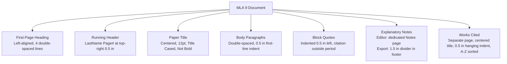

<div align="center">

# 📜 Scholia

### *The distraction-free, strictly formatted MLA 9 document editor with frosted glass transparency.*

[](Cargo.toml)
[](LICENSE)
[](https://www.rust-lang.org/)
[](#-mla-9th-edition-rules-enforced)
[](#-cross-platform-support)
[](#-building-from-source)
[](CONTRIBUTING.md)

<p align="center">
  <b>Built from scratch in 100% pure Rust using <code>egui</code> and native OS window vibrancy.</b><br>
  Engineered so that students, scholars, and researchers can focus entirely on writing without fear of formatting penalties.
</p>

</div>

---

## 📑 Table of Contents
- [Why Scholia?](#-why-scholia)
- [Key Features](#-key-features)
- [MLA 9th Edition Rules Enforced](#-mla-9th-edition-rules-enforced)
- [Notes & Explanatory Footnotes Architecture](#-notes--explanatory-footnotes-architecture)
- [Architecture & Design](#-architecture--design)
- [Custom Keybindings](#-custom-keybindings)
- [Frosted Glass & Transparency Engine](#-frosted-glass--transparency-engine)
- [Exporters & File Formats](#-exporters--file-formats)
- [Quick Start & Portable Build](#-quick-start--portable-build)
- [Production Release & Installers](#-production-release--installers)
- [Automated Testing](#-automated-testing)
- [Contributing](#-contributing)
- [License](#-license)

---

## 💡 Why Scholia?

Traditional word processors like Microsoft Word, Google Docs, and LibreOffice are *unconstrained general-purpose editors*. In those apps, small accidental clicks lead to severe academic formatting penalties:
- Accidentally using 1.15 line spacing or adding hidden 8pt margins between paragraphs.
- Using 14pt or 16pt font for headings (prohibited in MLA 9).
- Forgetting to indent body paragraphs by exactly 0.5 inches.
- Typing `"Page 1"` manually instead of a true running header `[LastName] 1`.
- Forgetting to alphabetize Works Cited entries or formatting hanging indents incorrectly.
- Putting citation punctuation inside quotes instead of after the parenthetical reference.

**Scholia eliminates formatting errors by construction**:
It provides a rich, fluent text editing canvas, but **it is fundamentally impossible to break MLA formatting**. All margins, font sizes, running headers, paragraph indents, block quotes, explanatory notes, and Works Cited entries are locked to MLA 9th Edition standards.

---

## 🌟 Key Features

- **Distraction-Free Single Canvas**:
  - Continuous manuscript editing canvas—does not break the editor into simulated paper sheets while drafting.
  - Manuscript typography is locked to authentic **Times New Roman** (12pt, double-spaced).
- **Separate In-Editor Notes Page**:
  - Explanatory notes display on an independent page sheet with running head `LastName 2`—only present when notes exist. The main writing page remains distraction-free without bottom note clutter.
  - Adding a note (`example^1` + Space, or `Ctrl+Shift+W`) displays the superscript character (`¹`, `²`) directly in the editor text. Deleting the marker from the text automatically deletes the note definition, and deleting the note removes the marker.
- **Strict Footer Notes on Export**:
  - On export (PDF, Word `.docx`, and HTML), notes are compiled directly into the page **footer** with standard MLA 1.5-inch rule divider (`______________________`), never on a separate page.
- **Native PDF Export**:
  - Direct PDF generation via `printpdf` with embedded standard fonts, running head, double-spacing, footer footnotes, and Works Cited.
- **Nerd Font Iconography**:
  - Automatically discovers user-installed Nerd Fonts (e.g. *Symbols Nerd Font*, *JetBrains Mono Nerd Font*) for crisp vector glyphs across all toolbars, buttons, and status indicators.
- **Translucent Frosted Glass UI**:
  - Native OS background blur (Windows 11 Mica, Windows 10/11 Acrylic, macOS Vibrancy).
  - The **writing paper sheet itself is transparent** with a customizable opacity slider (5% to 100%)—letting your desktop wallpaper softly glow through your manuscript.
- **MLA 9 Compliance Inspector**:
  - Real-time document linter (`Ctrl+L`) with a live compliance score (0–100%) and 1-click auto-fix buttons for non-compliant dates, titles, and headers.
- **Works Cited Manager**:
  - Interactive builder (`Ctrl+W`) implementing MLA 9's *Nine Core Elements* container model with automatic alphabetical sorting and true hanging indents.
- **In-Text Citation Assistant & In-Text Actions**:
  - Type `/cite` anywhere in prose to instantly open the parenthetical citation helper. In-text actions avoid keybind conflicts and are prominently displayed in the shortcuts panel.
  - Explanatory notes trigger via `word^N` followed by spacebar (e.g. `example^1 `).
- **Full Undo / Redo History Engine**:
  - Full document history supporting `Ctrl+Z` (Undo) and `Ctrl+Y` / `Ctrl+Shift+Z` / `Ctrl+Shift+Y` (Redo).
  - **Intelligent Word Grouping**: Keystrokes are batched by word instead of letter-by-letter. Pressing Undo rolls back an entire word at once. History states commit at word boundaries (spaces, punctuation, brackets) or natural pauses (> 1.0s).
  - **Configurable Action Capacity**: Default limit of 512 actions, user-configurable from 16 to 8,192 actions via Preferences and persisted across app launches.
  - Discrete document actions (sentence swaps, paragraph moves, block creation/deletion, notes, title conversions) are seamlessly recorded in history with cursor position restoration.
- **Unsaved Changes Protection**:
  - Intercepts all close mechanisms (OS window close, Alt+F4, Ctrl+Q, toolbar close button) and prompts with an unsaved changes confirmation dialog (`Save`, `Don't Save`, `Cancel`).
- **Smart Sentence Reordering & Block Navigation**:
  - `Ctrl+Alt+Left` and `Ctrl+Alt+Right` reorder and swap sentences within the active paragraph, intelligently handling terminal punctuation, abbreviations, quotes, and superscript notes while tracking cursor position.
  - `Ctrl+Alt+Up` and `Ctrl+Alt+Down` reorder active blocks/paragraphs.
  - Single `Enter` key automatically splits the current paragraph into a new block at cursor position.
  - `Up` and `Down` arrow keys navigate seamlessly across adjacent blocks when cursor reaches top/bottom boundaries.
  - Block quote detection: automatically prompts to convert prose passages exceeding 4 lines or 250 characters into MLA block quotes.
- **Typographical Cleaning Engine**:
  - Automatically transforms straight quotes to smart curly quotes (`“ ”`, `‘ ’`) and double dashes `--` to em dashes (`—`).
- **Customizable Interface**:
  - Settings dialog (`Ctrl+,`) displays application version (`v0.1.0`).
  - Option to toggle Windows navigation controls (minimize, maximize, close) in top right.
  - Option to toggle the shortcuts helper panel on the editor canvas.
  - Undo/redo action limit slider (16 to 8,192 actions).
  - Full keybinding remap manager with in-text action indicators.

---

## 📐 MLA 9th Edition Rules Enforced



| Element | MLA 9th Edition Standard | Scholia Enforcement |
|---|---|---|
| **Margins** | Exactly 1.0 inch (72 pt) all sides | Locked to 1.0 in (cannot be altered) |
| **Typeface** | Legible serif (e.g. Times New Roman) | Locked to approved MLA serifs |
| **Font Size** | Exactly 12 pt throughout entire paper | Fixed at 12 pt (headings are never oversized) |
| **Line Spacing** | Strict double spacing (2.0) | Enforced across all blocks and headings |
| **Heading Block** | Student, Instructor, Course, Date (DD Month YYYY) | Dedicated left-aligned fields with auto-MLA date picker |
| **Running Head** | `[LastName] [PageNumber]` at top-right 0.5 in | Auto-derived from student name, rendered top-right |
| **Paragraph Indent**| First line indented exactly 0.5 inches | Automatic 0.5-inch indent on body paragraphs |
| **Block Quotes** | For quotes >4 lines prose: 0.5 in indent, no quotes | Dedicated blockquote element with terminal citation |
| **Explanatory Notes**| Brief notes with superscripts, bottom footer rule | In-editor Notes page; export rendered strictly in page footer |
| **Works Cited** | New page, centered title, 0.5 in hanging indent | Dedicated manager, 9 core elements, auto-sorted |

---

## 📝 Notes & Explanatory Footnotes Architecture

MLA 9 differentiates between short in-text parenthetical citations and content/explanatory notes:
1. **Interactive In-Text Trigger**:
   - Type a word followed by `^<number>` and press **Space** (e.g. `example^1 ` or `example^10 `).
   - Spacebar confirms the note: typing does not trigger prematurely (allowing double or multi-digit note numbers like `10` or `13`), the typed word is preserved, and the superscript character (e.g. `¹`, `¹⁰`) is displayed directly in the editor text.
   - A structured `note_tags` JSON tag is registered in the paragraph block linked to that note number in `.mla`.
   - Two-way sync: deleting the note from the Notes page deletes the superscript character from the text, and deleting the superscript from the text removes the note definition.
   - **MLA 9 Unique Number Enforcement**: Attempting to reuse an existing note number (e.g. `word^1` when note 1 already exists) is rejected with a toast notification explaining the rule. The `^N` shorthand is automatically removed from text so the editor stays clean. Each note must be numbered consecutively and uniquely — MLA 9 forbids reuse or repetition.
2. **In the GUI Editor**:
   - Notes display as a clean, separate page sheet immediately preceding the Works Cited page (separated by natural page spacing without artificial "Page Break:" labels).
   - If no notes exist, the Notes page is **completely absent** from the canvas.
   - Hotkey `Ctrl+Shift+W` (or `Ctrl+Alt+N`) also adds a note linked to the active block.
3. **On Export (PDF, Word DOCX, HTML, Plain Text)**:
   - The exporter reads the paragraph's JSON tags and embeds the superscript callout (`¹`) directly attached to the tagged word.
   - If a note is on the page, it is placed into that page's **footer** above the bottom margin with the standard MLA 1.5-inch rule divider (`______________________`) in 10pt font, complying with MLA 9.
   - Export documents never include an artificial standalone "Notes" body page.

---

## 🏗️ Architecture & Design

```mermaid
graph LR
    subgraph UI ["GUI Layer (eframe / egui)"]
        Toolbar[Frosted Toolbar]
        Canvas[Translucent Page Canvas]
        StatusBar[Metrics Status Bar]
        Modals[Works Cited / Citation / Calendar / Settings Modals]
    end

    subgraph Core ["Core Engine (Rust)"]
        Model[MLA Document Model]
        Linter[MLA 9 Compliance Linter]
        Theme[Theme & Vibrancy Engine]
        Keybinds[Custom Keybindings Manager]
    end

    subgraph IO ["Persistence & Export"]
        PDF[Native printpdf Engine]
        DOCX[docx-rs Exporter]
        HTML[HTML Exporter]
        TXT[Plain Text Exporter]
        JSON[Native .mla Storage]
    end

    UI --> Core
    Core --> IO
```



- **Renderer**: `eframe` (0.36) with hardware-accelerated WGPU backend.
- **Window Vibrancy**: `window-vibrancy` crate hooked directly into native OS compositors (DwmSetWindowAttribute on Windows, NSVisualEffectView on macOS).
- **PDF Engine**: `printpdf` generating standard Letter pages with 1-inch margins, embedded serif fonts, running headers, and footer footnotes.
- **DOCX Engine**: `docx-rs` emitting valid ISO OpenXML documents with double-spacing attributes (`w:line="480"`), 1440 dxa margins, document footer notes, and 720 dxa indents.

---

## ⌨️ Custom Keybindings

Every action in Scholia is bound to an ergonomic shortcut and can be customized in Settings (`Ctrl+,`):

| Action | Default Shortcut | Description |
|---|---|---|
| **New Document** | `Ctrl+N` | Start a clean MLA document |
| **Open Document** | `Ctrl+O` | Load an existing `.mla` project |
| **Save Document** | `Ctrl+S` | Save current document to disk |
| **Export DOCX** | `Ctrl+E` | Export to Microsoft Word (`.docx`) |
| **Export PDF** | Toolbar Button | Export directly to native PDF via `printpdf` |
| **Works Cited Manager** | `Ctrl+W` | Open Works Cited database & builder |
| **Add Note / Definition** | `^N` + Space (In-Text) | Insert explanatory note marker (e.g. `word^1 `) |
| **MLA Compliance Linter** | `Ctrl+L` | Open MLA 9 Compliance Inspector |
| **Delete Paragraph** | `Ctrl+Backspace` | Delete active paragraph or block |
| **Insert Block Quote** | `Ctrl+Shift+B` | Insert MLA block quotation (0.5 in indent) |
| **Insert Heading 1** | `Ctrl+Alt+1` | Insert Section Heading (Bold, flush left) |
| **Insert Heading 2** | `Ctrl+Alt+2` | Insert Section Heading (Italics, flush left) |
| **Insert Heading 3** | `Ctrl+Alt+3` | Insert Section Heading (Bold, centered) |
| **Insert Citation** | `/cite` (In-Text) | Insert in-text parenthetical citation modal |
| **Move Block Up** | `Ctrl+Alt+Up` | Reorder active block up |
| **Move Block Down** | `Ctrl+Alt+Down` | Reorder active block down |
| **Move Sentence Left** | `Ctrl+Alt+Left` | Reorder / swap active sentence with previous sentence |
| **Move Sentence Right** | `Ctrl+Alt+Right` | Reorder / swap active sentence with next sentence |
| **Format Title Case** | `Ctrl+Shift+T` | Convert title to strict MLA Title Case |
| **Undo** | `Ctrl+Z` | Undo last word or discrete action |
| **Redo** | `Ctrl+Y` / `Ctrl+Shift+Z` | Redo undone action or word |
| **Preferences / Settings** | `Ctrl+,` | Open theme, transparency, and keymap settings |
| **Zen / Focus Mode** | `F11` | Toggle distraction-free fullscreen writing |
| **Block Split** | `Enter` | Split current paragraph into two blocks at cursor |
| **Block Navigation** | `Up` / `Down` | Move cursor between blocks when at boundary |

---

## 🪟 Frosted Glass & Transparency Engine

Scholia features a dual-layer transparency model:
1. **Window Background Vibrancy**: Utilizes native OS blur APIs (Windows 11 Mica / Acrylic, macOS `NSVisualEffectView`).
2. **Transparent Writing Page**: Features a **Page Sheet Opacity slider (5% to 100%)** allowing your desktop wallpaper to softly shine through your manuscript canvas.
3. **90% Opaque Modal Windows & 80% Viewport Height**: Dialog windows (Preferences, Unsaved Changes, Citations, Works Cited, MLA Compliance, Date Picker) feature a 90% opaque / 10% transparent background (`alpha = 230`), ensuring high contrast and legibility while keeping the main workspace and page completely transparent. The Preferences modal automatically sizes to 80% of vertical screen height with smooth internal scrolling.
4. **Seven Curated Theme Presets**:
   - **Frosted Obsidian**: Dark obsidian glass with frost-cyan accents.
   - **Frosted Parchment**: Translucent light paper with deep sapphire accents.
   - **Nordic Frost**: Arctic midnight translucent glass.
   - **Amber Glass**: Warm retro terminal glass.
   - **Rosé Pine**: All-natural pine, subtle dark lavender, and warm rose accents.
   - **Rosé Pine Moon**: Deep violet dark variation with muted pastel highlights.
   - **Rosé Pine Dawn**: Warm parchment pastel daylight variant with delicate rose accents.
   - **Custom**: Granular RGB pickers for window tint, page sheet tint, text, accent, and borders.
5. **Unified Themes Management (`themes/`)**:
   - Unified Themes table displaying all built-in presets alongside user-installed custom themes.
   - Save your current color theme as a portable `.json` file in `themes/`.
   - Import community themes with one click.
   - Open the dedicated `themes/` folder in OS File Explorer (`explorer`, `open`, or `xdg-open`) to easily share themes with colleagues.
   - Clean default installation with zero custom theme clutter.

---

## 🚀 Quick Start & Portable Build

### 1. Run Directly with Cargo
```bash
cargo run
```

### 2. Build Standalone Portable App (Testing Mode)
In portable mode, the app compiles into a standalone, single executable with zero installation required:

#### Windows
```powershell
.\build_portable.ps1
```
Creates:
- `dist\Scholia-Portable\scholia.exe`
- `dist\Scholia-v0.1.0-portable-windows-x64.zip`

#### macOS / Linux
```bash
./build_portable.sh
```
Creates:
- `dist/Scholia-Portable/scholia`

*(Note: Portable and CI release packages contain the standalone executable and license file).*

---

## 📦 GitHub Actions & Multi-Platform Releases

The repository includes a GitHub Actions workflow (`.github/workflows/release.yml`) that builds and publishes releases across all platforms under **one unified GitHub Release**:
- **Windows x64**: `Scholia-v0.1.0-windows-x64.zip`
- **macOS Apple Silicon (arm64)**: `Scholia-v0.1.0-macos-arm64.zip`
- **macOS Intel (x64)**: `Scholia-v0.1.0-macos-x64.zip`
- **Linux x64**: `Scholia-v0.1.0-linux-x64.tar.gz`
- **Checksums**: Automatically computed and attached as `SHA256SUMS.txt`.

Release packages strictly contain the executable binary and `LICENSE` without extraneous sample files or documentation.

---

## 🧪 Automated Testing

The project includes an automated test suite verifying MLA capitalization, date parsing, compliance rules, works cited sorting, footnote export, and document exporters:

```bash
cargo test
```

All 30 test suites pass cleanly out of the box:
- `test_mla_title_case_capitalization`
- `test_mla_current_date_format`
- `test_mla_compliance_linter`
- `test_works_cited_alphabetization`
- `test_document_exporters`
- `test_notes_exported_in_footer_not_separate_page`
- `test_explanatory_notes_and_superscript_engine`
- `test_word_superscript_note_shortcut_and_json_tag`
- `test_block_toggle_conversion`
- `test_document_block_operations_and_sync`
- `test_block_deletion_focus_and_keybinds`
- `test_sentence_splitting_and_reordering`
- `test_document_sentence_reordering_and_keybinds`
- `test_word_count_and_pdf_page_count`
- `test_editor_page_centering`
- `test_interface_options_and_removed_shortcuts`
- `test_calendar_modal_state`
- `test_typographical_cleaning`
- `test_font_configuration_and_nerd_icons`
- `test_semantic_versioning`
- `test_transparent_button_visuals`
- `test_word_grouping_undo_and_redo`
- `test_multi_word_boundary_grouping`
- `test_discrete_actions_undo_and_redo`
- `test_undo_redo_shortcuts_and_keybinds`
- `test_history_limits_and_configuration`
- `test_unsaved_changes_dialog_behavior`
- `test_modal_fill_color_ninety_percent_opacity`
- `test_rose_pine_theme_presets`
- `test_theme_folder_save_and_load_roundtrip`

---

## 🤝 Contributing

Contributions are welcome! Please read [CONTRIBUTING.md](CONTRIBUTING.md) and [CODE_OF_CONDUCT.md](CODE_OF_CONDUCT.md) for details on code style, formatting, and the pull request process.

---

## 📜 License

Distributed under the MIT License. See [LICENSE](LICENSE) for more information.
